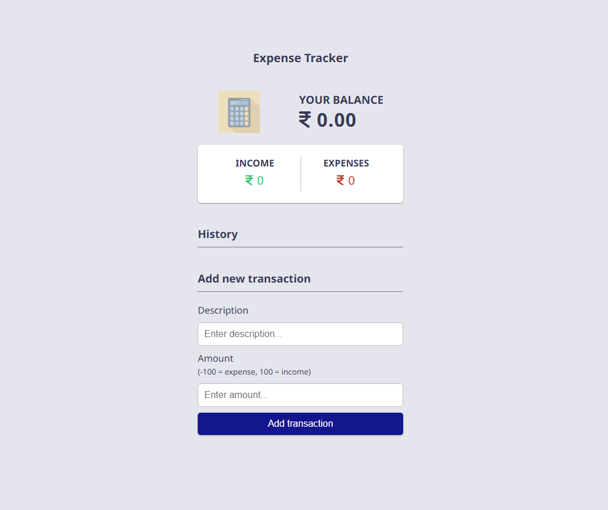
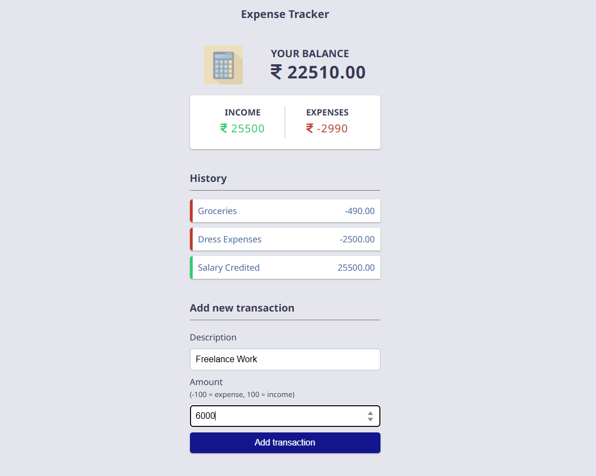
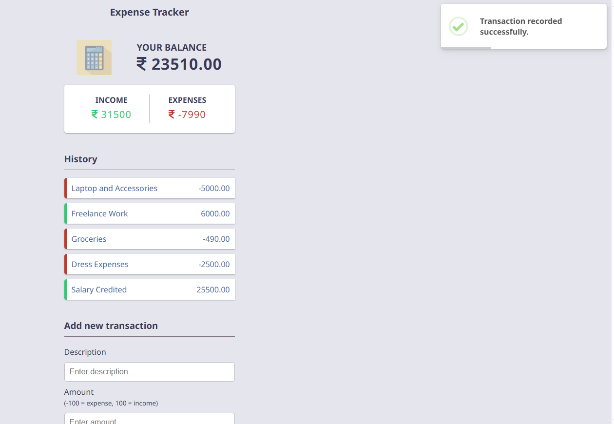
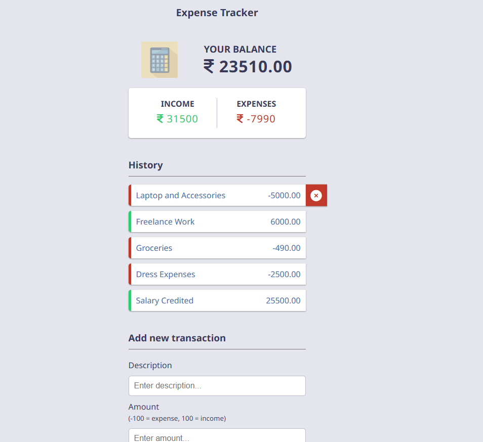
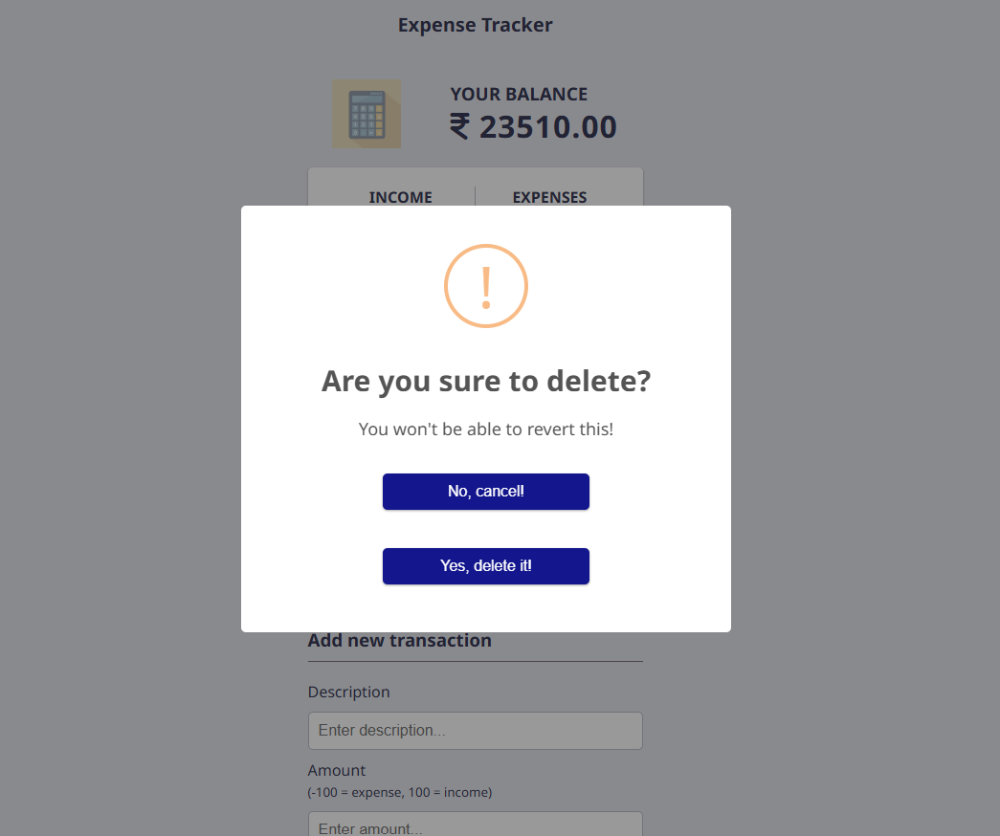
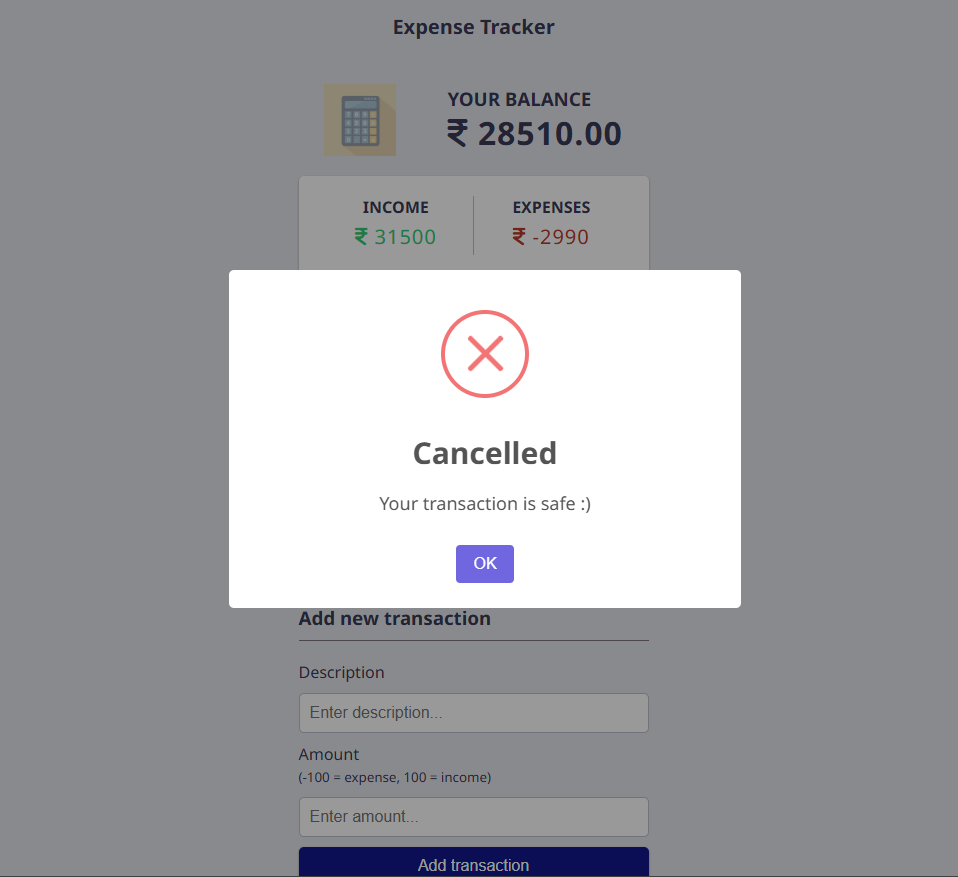

# 📝 Expense Tracker 💰

An Expense Tracker application built using **Django** to manage income and expenses efficiently. This app helps users keep track of their financial transactions and maintain a real-time balance.

## 🚀 Features
✅ Add **income** and **expense** transactions  
✅ Categorize transactions as **Credit** (Income) or **Debit** (Expense)  
✅ Display **current balance dynamically**  
✅ View **transaction history with timestamps**  
✅ **Delete transactions** while ensuring the balance remains accurate  
✅ Implemented **SweetAlert** for confirmation pop-ups  
✅ **User-friendly UI** using Bootstrap and JavaScript  

---
<br><br>
## 🖼️ Screenshots  
Here are some images of the application in action:

### **📌 Index Page**


### **📌 Transaction List**


### **📌 Toast Message After Successfull Transaction**



### **📌 Delete Transaction Option**


### **📌 Delete Confirm Modal**


### **📌 Delete  Abort Message**



> **Note:** Make sure the images are stored in the `static/images` folder in your project directory and pushed to GitHub.

---
<br><br>
## 🛠️ Installation Guide
Follow these steps to set up the project on your local machine:

### **1️⃣ Clone the Repository**
```bash
git clone https://github.com/yourusername/expense-tracker.git
cd expense-tracker
```
### **2️⃣ Create a Virtual Environment (Optional)**
```bash
python -m venv myvenv
source myvenv/bin/activate  # On Windows: myvenv\Scripts\activate
```
### **3️⃣ Install Dependencies**
```bash
pip install -r requirements.txt
```
### **4️⃣ Set Up Environment Variables**
Create a .env file in the root directory and add the following:
```ini
SECRET_KEY="your_secret_key_here"
DEBUG=True
```
### **5️⃣ Apply Migrations**
```bash
python manage.py migrate
```
### **6️⃣ Run the Server**
```bash
python manage.py runserver
```
---
<br><br>
# 💡 Usage
#### 1️⃣ Add transactions (income/expense)
#### 2️⃣ View balance updates dynamically
#### 3️⃣ Check transaction history
#### 4️⃣ Delete transactions safely

---
<br><br>
# 🏗️ Technologies Used
#### ➡️ Django (Backend)
#### ➡️ SQLite (Database)
#### ➡️ Bootstrap (UI Design)
#### ➡️ SweetAlert (Pop-up confirmations)
#### ➡️ JavaScript (Enhancements)

---
<br><br>
# 📜 License
This project is licensed under the MIT License - see the LICENSE file for details.

---
<br><br>
# ⭐ Show Some Love!
If you find this project useful, please consider starring ⭐ the repository!
